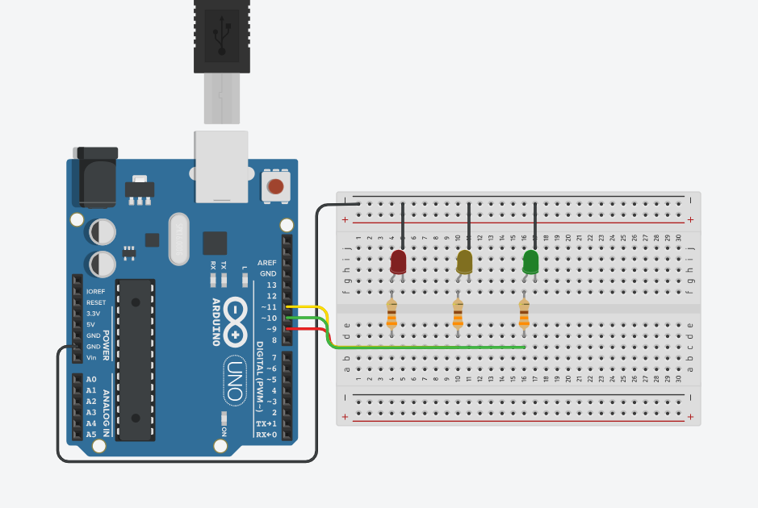

# Serial-LED-Control
Control which LED blinks and how many times via Serial Monitor input.

>Built while following [Paul McWhorter's Arduino Tutorials](https://www.youtube.com/playlist?list=PLGs0VKk2DiYw-L-RibttcvK-WBZm8WLEP) series
---
## Demo

---
## How It Works
The user types a color (`red`,`green` or `yellow`) and the amount of blicks into the Serial Monitor. The Arduino reads the entered values and information, validates it, and blinks the corresponding LED the requested number of times.

---
## Circuit

## Components
* Arduino Uno
* 1x Red LED
* 1x Green LED
* 1x Yellow LED
* 3x 330Ω Resistor
* Bread Board + Jumper Wires

---
## What I Learned
* Serial communication with `Serial.begin()`,`Serial.readString`,`Serial.parseInt`
* String comparison and input validation
* Controlling multiple output pins based on user input

---
## Skills
`Arduino C++` `Serial Communication` `Embedded Systems`
